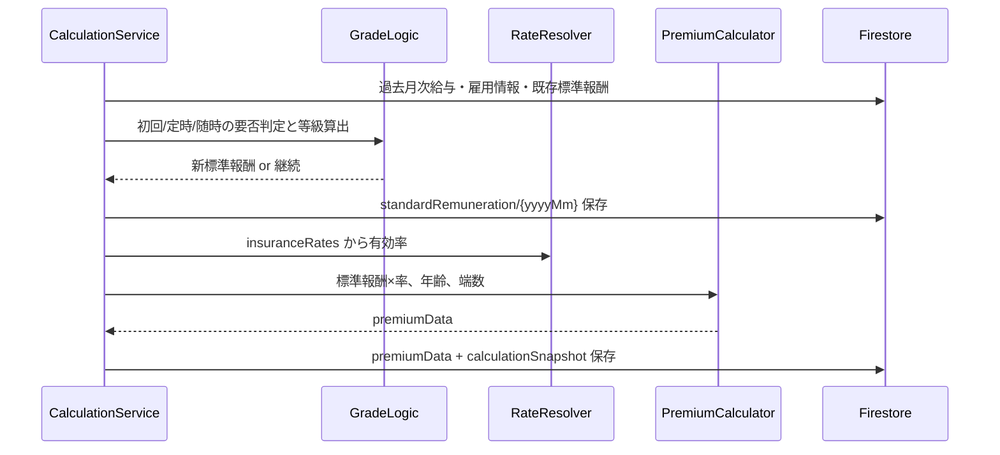

`tenants/{tid}/insuranceRates/{rateId}` の方が、第1フェーズの目的（**適用時期ごとの料率を残し、過去月の再計算根拠を説明できる**）に合っています。計画書の `settings/insuranceRates` よりこちらを採用するのがよいです。

---

## `insuranceRates` の置き場所

| 案 | 評価 |
|----|------|
| `tenants/{tid}/settings/insuranceRates/{rateId}` | 既存の `settings/bonusSetting`（**1ドキュメント固定**）に寄せた形。履歴が増えるマスタにはやや不自然 |
| **`tenants/{tid}/insuranceRates/{rateId}`** | [my-study.txt](my-study.txt) の「insurance rates (sub-collection)」と一致。**履歴・クエリ・Security Rules** に向く |

**採用パス（推奨）**

```
tenants/{tid}/insuranceRates/{rateId}
  effectiveFrom: '2026-04-01'   // この日から適用（YYYY-MM-DD）
  healthInsuranceRate: number   // 例 0.0998（協会けんぽは手入力 or 後で都道府県マスタ）
  careInsuranceRate: number
  pensionInsuranceRate: number  // 既定 0.183、基金加入時は任意
  employerShare: number         // 折半なら 0.5
  roundingRule: 'statutoryHalfYen' | 'roundDown' | ...
  createdAt / updatedAt
```

**料率の解決ルール（計算時）**

```text
対象月 yyyyMm の末日（または支給日）に対し、
effectiveFrom <= 対象日 のうち最も新しい1件を採用
```

過去月を再計算するときも、その月に有効だった率が取れる（カタログの「アーカイブ化」）。

**端数・徴収月・支払基礎日数**は引き続き [tenant-document.ts](src/app/tenant-document.ts) の `socialInsuranceSettings` に置いてよい。ただし **計算結果には `calculationSnapshot` に実際に使った率をコピー** する（後から率マスタを変えても過去月の説明ができる）。

---

## 第1フェーズの具体的方針（実装の順番と中身）

### ゴール（完了の定義）

1. 月次給与が入っている従業員について、**標準報酬月額（健保・厚年等級）** が決まる（簡易の初回・定時・随時）
2. その標準報酬と **有効な insuranceRates** から **健保・介護（40–65）・厚年** の本人/会社負担が計算される
3. 結果が `monthly-records/{yyyyMm}/employees/{eid}` の `premiumData` と `calculationSnapshot` に保存され、月次一覧で見える
4. 「当月を再計算」ボタンで一括実行できる

**まだやらない**: task-board 通知、月次 LOCK、届出 PDF、賞与4回、年間平均、得喪の細則。

---

### Step 1 — ドメイン（純粋関数・テスト先行）

既に空ファイルがある [src/app/social-insurance/](src/app/social-insurance/) を埋める。

| ファイル | 内容（第1版のルールをファイル先頭コメントで固定） |
|----------|-----------------------------------------------|
| `remuneration/grade-table.ts` | 健保50等級・厚年32等級の **TS定数**。`報酬月額 → { healthGrade, pensionGrade, standardAmount }` |
| `remuneration/fixed-wage.ts` | 報酬月額 = `basicSalary + commuterAllowance + otherAllowance`（残業・遡及は第1版では報酬月額に含めるか方針を1つに固定） |
| `remuneration/payment-base-days.ts` | **簡易**: 月次レコードあり = 17日以上とみなす（勤怠未実装のため） |
| `remuneration/teiji-determination.ts` | 当年4–6月の報酬月額平均 → 等級（対象外ルールは第1版スキップ or フラグのみ） |
| `remuneration/zuiji-determination.ts` | 固定的賃金変動月から連続3ヶ月平均 → 従前比 **2等級以上** なら改定案 |
| `premium/rounding.ts` | 50銭基準の労使折半 |
| `premium/premium-calculator.ts` | 標準報酬 × 各率、介護は生年月日40–65、折半 |

**ユニットテスト**: 等級境界、50銭端数、介護の有無だけ先に固める。

---

### Step 2 — Firestore 型と読み書き

| パス | ドキュメント |
|------|----------------|
| `tenants/{tid}/insuranceRates/{rateId}` | 上記料率マスタ（**履歴はドキュメント追加のみ。上書き削除しない**） |
| `tenants/{tid}/employees/{eid}/standardRemuneration/{yyyyMm}` | `healthGrade`, `pensionGrade`, `standardRemuneration`, `source: initial \| teiji \| zuiji \| manual`, `effectiveFrom` |
| `tenants/{tid}/monthly-records/{yyyyMm}/employees/{eid}` | 既存 + `premiumData` 有効化 + `calculationSnapshot` |

新規型例:

- `insurance-rate-document.ts`
- `standard-remuneration-document.ts`
- [monthly-document.ts](src/app/monthly-document.ts) に `CalculationSnapshot`（使用した `rateId`, 各率, 等級, 報酬月額）

**サービス**

- `InsuranceRateDataService`: 一覧取得、`resolveRate(tid, targetDate)`（effectiveFrom 降順で1件）
- `StandardRemunerationDataService`: 履歴の読み書き

---

### Step 3 — 等級決定のオーケストレーション

`SocialInsuranceCalculationService`（1人×1月）の流れ:



**第1版の判定優先（シンプルに）**

1. 当該月に `standardRemuneration` が手動 or 既に確定済み → それを使用
2. なければ **随時改定候補** を試算（3ヶ月窓）→ 該当すれば `zuiji` で保存
3. 4–6月が揃っていれば **定時** を試算（9月適用は第2フェーズでも、第1版は「計算月から使う」で簡略化可）
4. なければ **入社月の報酬** から `initial`
5. どれも無ければ直近履歴を継続

※「定時は9月から適用」は第1フェーズでは **`effectiveFrom` を決めて履歴に書く** 程度に留め、UIで「適用開始月」を表示すれば足りる。

---

### Step 4 — 月次バッチ

`MonthlyPremiumBatchService`（計画どおり）:

- 対象 `yyyyMm` の `monthly-records/.../employees` を全件
- [MonthlyListDataService](src/app/monthly-management/monthly-list/monthly-list-data.service.ts) で従業員マスタと merge
- 1人ずつ `SocialInsuranceCalculationService` → `writeBatch`（500件制限に注意）

既存 [monthly-list.cmp.ts](src/app/monthly-management/monthly-list/monthly-list.cmp.ts) に「再計算」ボタンを接続。

---

### Step 5 — UI（最小）

1. **事業所設定** — 料率履歴の追加一覧（`effectiveFrom` + 各率）。新規追加 = 新 `rateId` ドキュメント。既存 [tenant-setting](src/app/tenant-setting/) の社会保険タブ内でよい
2. **月次一覧** — 列追加: 標準報酬（参照）、健保本人/会社、介護、厚年。表示項目設定にも追加
3. **（任意）** 従業員詳細 — 標準報酬履歴の読み取り専用リスト

---

### Step 6 — シード置き換え

[monthly-records-seed.data.ts](src/app/monthly-management/monthly-records-seed/monthly-records-seed.data.ts) の `basicSalary * 0.0495` をやめ、上記エンジン経由にする（またはシード時だけ rate + grade を最低限セット）。

---

## 第1フェーズで固定しておく「簡易」前提（計画書のリスク欄の具体化）

| 項目 | 第1フェーズの扱い |
|------|-------------------|
| 固定的賃金 | `basicSalary + commuterAllowance + otherAllowance` |
| 随時の3ヶ月 | カレンダー月連続3ヶ月、いずれも月次レコードあり |
| 2等級差 | 健保または厚年のいずれかで2以上（第1版は両方チェック推奨） |
| 支払基礎日数17日 | 月次レコード存在 = OK |
| 定時対象外（6/1以降入社など） | 第1版は未実装 or 警告ログのみ |
| 賞与の定時算入 | 未実装（`bonusData` は保険料計算に未使用） |
| 協会けんぽの都道府県別料率 | 手入力の `insuranceRates` |
| 月次 LOCK | 未実装（再計算は常に可能） |

---

## 計画書の更新ポイント（1行）

Firestore の行を次のように差し替えるとよいです。

- ~~`tenants/{tid}/settings/insuranceRates/{rateId}`~~  
- **`tenants/{tid}/insuranceRates/{rateId}`**（`effectiveFrom` で履歴管理、`resolveRate` で計算時に1件選択）

---

実装を進めるときは Agent モードに切り替えてもらえれば、Step 1（等級表 + 端数 + テスト）から着手できます。まず計画ファイルのパス表だけ直す場合も、同モードで対応できます。