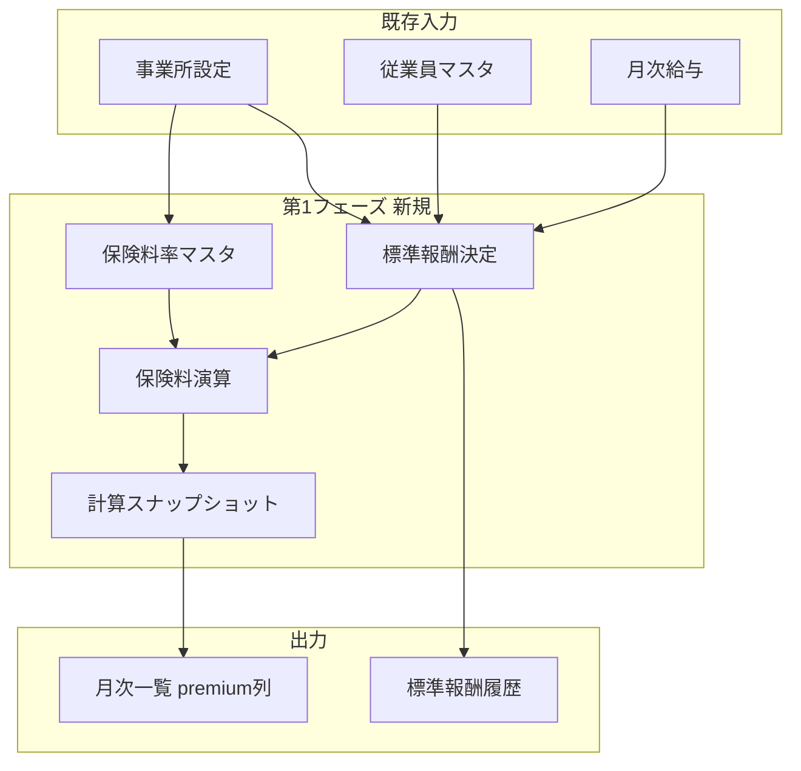

# 社会保険演算機能 実装計画

## 現状とギャップ

**できている（前提）**
- 事業所マスタ: [tenant-document.ts](src/app/tenant-document.ts) の `socialInsuranceSettings`（健保種別・締め日・支払基礎日数・徴収月・特定被保険者など）
- 従業員マスタ: [employee-document.ts](src/app/employee-document.ts)（生年月日・雇用・入退社日）
- 月次給与: [monthly-document.ts](src/app/monthly-document.ts) の `payrollData` / `bonusData`、一覧・CSVインポート
- UI 骨格: 月次管理・従業員管理・事業所設定・空の [task-board.cmp.ts](src/app/task-board/task-board.cmp.ts)

**未実装（カタログ [catalogue-re.10149.txt](catalogue-re.10149.txt) との差）**
- 保険料率マスタ（時期別・組合健保の任意率・折半率・端数処理）
- 標準報酬月額テーブル（健保50等級 / 厚年32等級）と履歴
- 報酬月額 → 等級決定（定時・随時・特例・賞与算入・年齢・得喪）
- 標準報酬 × 料率 → 健保・介護・厚年（本人/会社）の自動計算と `premiumData` 永続化
- スクリーニング通知・task-board・月次確定ロック・帳票出力・監査ログ

---

## 設計方針

1. **正データの分離**
   - 社員番号・氏名: 従業員マスタ（既存方針を維持）
   - 標準報酬・保険料: 計算結果＋履歴を Firestore に保存し、再計算時は根拠（スナップショット）も保存（[my-study.txt](my-study.txt) の `snapshotRules` 思想）

2. **純粋関数のドメイン層**
   - Angular サービスは入出力のみ。テスト可能な `src/app/social-insurance/calculation/`（名称は例）に集約
   - 既存 [monthly-records-seed.data.ts](src/app/monthly-management/monthly-records-seed/monthly-records-seed.data.ts) の `basicSalary * 0.0495` は第1フェーズ完了後に置き換え

3. **affiliations に employeeId を載せない**
   - ヘッダー表示は [current-tenant.service.ts](src/app/current-tenant.service.ts) と同様、従業員マスタ参照で十分

4. **第1フェーズの「簡易版」範囲**
   - **含む**: 資格取得時の初回等級、定時決定（4–6月平均・17日ルール簡易）、随時改定（3ヶ月平均・2等級差・17日ルール簡易）、月次保険料（健保・介護40–65・厚年・労使折半・50銭端数）
   - **含まない（第2フェーズ以降）**: 賞与4回判定、年間平均、特例随時改定、得喪の複雑ケース、二以上事業所、帳票PDF、月次LOCK、task-board 通知

---

## 第1フェーズ: データモデル

### Firestore 拡張（案）

| パス | 内容 |
|------|------|
| `tenants/{tid}/settings/insuranceRates/{rateId}` | 適用開始日、健保料率、介護料率、厚年料率、折半率、端数処理 |
| `tenants/{tid}/employees/{eid}/standardRemuneration/{yyyyMm}` | 健保等級・厚年等級・標準報酬月額、決定理由（`teiji` / `zuiji` / `initial` / `manual`） |
| `tenants/{tid}/monthly-records/{yyyyMm}` | 月次メタ（`status: open \| locked` は第2フェーズでも可） |
| `tenants/{tid}/monthly-records/{yyyyMm}/employees/{eid}` | 既存に加え `premiumData` 有効化、[PremiumData](src/app/monthly-document.ts)、`calculationSnapshot`（料率・等級・報酬月額） |

### TypeScript

- [monthly-document.ts](src/app/monthly-document.ts): `premiumData` のコメント解除、`calculationSnapshot` 型追加
- 新規 `standard-remuneration-document.ts`, `insurance-rate-document.ts`
- [tenant-document.ts](src/app/tenant-document.ts): 端数処理・折半率フィールド追加（UI は [tenant-setting.cmp.html](src/app/tenant-setting/tenant-setting.cmp.html)）

### マスタデータ

- 標準報酬等級表: 初版は **協会けんぽ・厚年の法定表を TypeScript 定数**（`system_constants` Firestore は第2フェーズでバージョン管理）
- 協会けんぽの都道府県別健保料率: 第1フェーズは事業所設定の **手入力率** または全国平均のデフォルト1セット

---

## 第1フェーズ: ドメイン演算

新規モジュール `src/app/social-insurance/`（構成例）

| モジュール | 責務 |
|-----------|------|
| `remuneration/grade-table.ts` | 報酬月額 → 健保/厚年等級・標準報酬月額 |
| `remuneration/payment-base-days.ts` | 暦日/締め日基準の支払基礎日数（第1版は月給＝暦日 or 固定17日以上フラグでも可） |
| `remuneration/fixed-wage.ts` | 月次 `payrollData` から固定的賃金・報酬月額を算出（残業は随時の非固定扱い等、ルールを1ファイルに明文化） |
| `remuneration/teiji-determination.ts` | 4–6月平均 → 定時決定等級 |
| `remuneration/zuiji-determination.ts` | 3ヶ月窓・2等級差判定 |
| `premium/premium-calculator.ts` | 標準報酬 × 料率、介護対象年齢、折半、端数（50銭） |
| `premium/rounding.ts` | 法令50銭 / 事業所独自ルール |

**サービス層**
- `SocialInsuranceCalculationService`: 1従業員×1ヶ月の再計算オーケストレーション
- `MonthlyPremiumBatchService`: 対象月の全員 batch 再計算（既存 [monthly-list-import.service.ts](src/app/monthly-management/monthly-list/monthly-list-import.service.ts) パターンに合わせる）

---

## 第1フェーズ: UI 接続

1. **事業所設定**（[tenant-setting](src/app/tenant-setting/)）
   - 保険料率の登録タブまたは既存「社会保険」タブ内に料率・端数・折半率
   - 協会けんぽ / 組合健保の分岐は既存 `healthInsuranceType` を利用

2. **月次一覧**（[monthly-list.cmp](src/app/monthly-management/monthly-list/monthly-list.cmp.ts)）
   - [monthly-list-columns.ts](src/app/monthly-management/monthly-list/monthly-list-columns.ts) に保険料列（健保本人/会社、介護、厚年）を追加（表示項目設定にも反映）
   - 「当月を再計算」ボタン → batch 実行 → 結果ダイアログ
   - 行に標準報酬等級・報酬月額（参照用）をオプション表示

3. **従業員詳細**（任意・第1フェーズ末）
   - 標準報酬履歴タイムライン（読み取り専用）

4. **月次設定**
   - インポート列から `employeeId`/`displayName` は照合専用のまま（現状維持）

---

## 第2フェーズ: 判定・通知（カタログ §自動判定）

- [task-board.cmp.ts](src/app/task-board/task-board.cmp.ts) にカード一覧（随時改定候補・定時対象外・年齢到達・届出期限）
- `ScreeningService` が月次確定前に `zuiji` / `teiji` / 年齢を走査
- 既存 [tenant-notification](src/app/notifications/) と連携

---

## 第3フェーズ: 運用・出力（カタログ §閲覧・出力・フロー）

- 月次 `LOCK`、再計算禁止
- 絞り込み閲覧、CSV/PDF（算定基礎届・月変届はテンプレート別）
- 従業員マイページの変動理由表示
- 監査ログ（4W1H）

---

## 第4フェーズ: 高度要件

- 賞与4回カウントと定時算入
- 年間平均・同意フロー
- 特例随時改定・得喪・二以上事業所の直接入力
- 協会けんぽの所在地別料率自動適用

---

## 実装順（第1フェーズの推奨コミット単位）

1. 型定義・等級表定数・端数/料率の純粋関数＋ユニットテスト
2. Firestore 読み書き（料率マスタ・標準報酬履歴）
3. 定時/随時/初回の等級決定サービス
4. 保険料計算サービス + `premiumData` 保存
5. 事業所設定 UI（料率・端数）
6. 月次一覧 UI（再計算・保険料列）
7. シードデータの premium 生成を新エンジンに差し替え

---

## リスク・前提の確認

- **固定的賃金の定義**: 第1フェーズでは `basicSalary + commuterAllowance + otherAllowance（固定扱い）` など、仕様を `fixed-wage.ts` 先頭コメントで固定し、後から設定化
- **支払基礎日数**: 勤怠未入力のため、第1版は「月次レコードが存在＝17日以上」または暦日満了の簡易判定
- **法改正**: 等級表・料率は年度更新が必要 → 第2フェーズで `system_constants/laws_{yyyy}` を検討（[my-study.txt](my-study.txt) 案）
